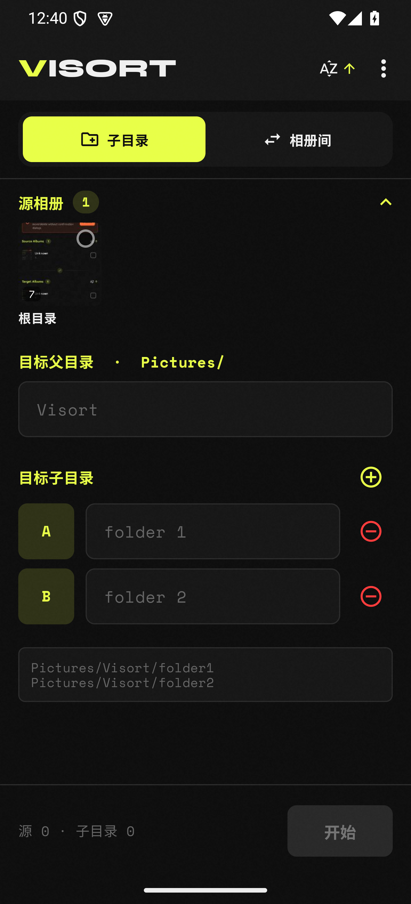
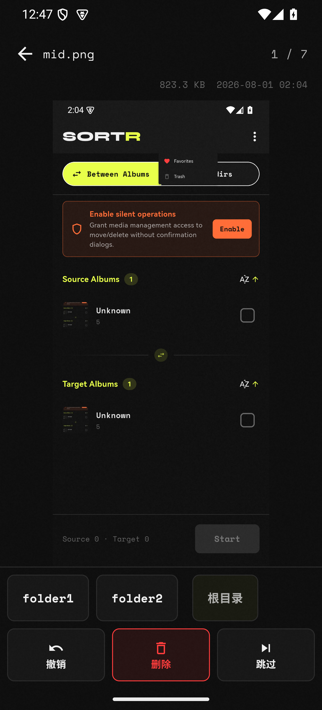
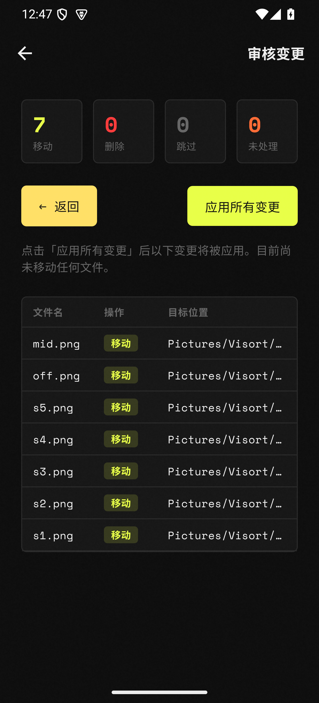

<div align="center">

# VISORT

**键盘 / 快捷键驱动的图片整理工具** — 桌面 + 安卓

逐张浏览，一键分类，确认前不碰任何文件。

[**English**](readme.md)

[](https://flutter.dev)
[](https://dart.dev)
[](LICENSE)

</div>

---

## 为什么不是又一个相册？

主流相册（Google Photos、各厂商系统相册）擅长**浏览**，但**整理**很弱——要么手动长按逐张选中再移动，慢到让人放弃；要么交给 AI 自动分类，黑盒且不可控。结果就是照片越堆越多，永远懒得理。

VISORT 是一个**整理工具**，不是看图器：

- **一键一决策的流水线** — 全屏看一张图，按一个键（或点一个目标）即刻分类，下一张自动接上。几分钟过完几百张，像流水线一样顺。
- **暂存 + 复核，绝不误操作** — 所有移动 / 删除先进内存暂存，执行前给完整的统计预览，确认才落地。主流相册的删除是即时的，VISORT 给你反悔的机会。
- **完全本地，零云端** — 图片不离开设备，没有 AI 扫描、没有上传、没有账号。你的照片就是你的。
- **两种整理模式** — 移入已有相册，或按自定义子目录规则分类（键 A →「保留」，键 B →「待删」），适配任何整理习惯。
- **跨平台** — Windows 桌面键盘驱动 + Android 触屏，同一套整理逻辑。

> 核心设计原则：**所有操作先暂存，确认后才执行。** 不会误删、不会误移。

## 平台

| 平台 | 状态 | 特色 |
|---|---|---|
| **安卓** | 活跃开发中 · 相册体验为核心 | MediaStore 原生相册浏览 + 触屏整理 |
| **Windows 桌面** | 稳定 · 功能完整 | 键盘驱动分类，窗口状态持久化 |

代码库是 [`visort_flutter/`](visort_flutter/) 下的 **Flutter 应用**，移植自早期的 Python / Flask 实现（已移除）。

---

## 安卓版

原生 MediaStore 集成，直接操作系统相册，零拷贝。下面按完整整理流程展示（模拟器实拍）：

### 相册浏览与整理配置

<p align="center">
  
</p>

keyset 游标分页的 MediaStore 图库，ContentObserver 实时刷新。首页同时承载相册列表与整理配置：选源相册（可多选），设定目标——移入已有相册（Between Albums），或按自定义子目录分类（Subdirs，键 A →「保留」、键 B →「待删」）。

### 逐图排序

<p align="center">
  
</p>

全屏看一张图，点按底部目标即分类（folder1 / folder2 / 根目录 / 删除 / 跳过），下一张自动接上——无需长按多选，几分钟过完几百张。

### 复核

<p align="center">
  
</p>

执行前给出完整的暂存操作统计（已移 / 已删 / 已跳过）与逐文件明细表，确认无误再继续。此刻所有操作仍在内存，文件未动。

### 执行

<p align="center">
  
</p>

确认后一次性应用所有变更。授权媒体管理后批量移动 / 删除免弹窗；删除走系统回收站，可恢复。

---

**其他特性：** 收藏跨相册聚合视图 · 中英文一键切换 · 同名冲突自动加后缀

---

## Windows 桌面端

> 截图待补充。

- **键盘优先** — 单键移动 / 删除 / 跳过，全屏逐张裁决，效率远超鼠标点选
- **暂存执行** — 同安卓版，所有操作入内存队列，Run 前不动文件系统
- **窗口记忆** — 位置 / 尺寸持久化，下次打开还原
- **冲突处理** — 同名文件自动加数字后缀，永不覆盖

---

## 快速开始

需要 [Flutter ≥ 3.44](https://flutter.dev)（Dart ≥ 3.12）。

```bash
git clone https://github.com/synxvi/visort.git
cd visort/visort_flutter
flutter pub get
flutter run -d android        # 安卓真机 / 模拟器
flutter run -d windows        # Windows 桌面
```

构建：

```bash
flutter build apk --release       # → build/app/outputs/flutter-apk/
flutter build windows --release   # → build/windows/x64/runner/Release/
```

> 安卓 release 构建目前用 debug 签名（尚未配置生产 keystore）。

## 支持格式

18 种：JPG · PNG · GIF · BMP · WEBP · TIFF · TIF · SVG · ICO · HEIC · HEIF · RAW · CR2 · NEF · ARW · DNG · AVIF

## 技术栈

| 层 | 技术 |
|---|---|
| 界面 / 逻辑 | Flutter（Dart ≥ 3.12），Riverpod ^2.6.1 |
| 安卓原生 | Kotlin + MediaStore（MethodChannel + EventChannel + ContentObserver） |
| Windows 原生 | CMake 运行器（C++17） |
| 测试 | `flutter_test`，58 个单测用例 |
| 状态 | 内存暂存，无数据库 |

## 文档

- [`AGENTS.md`](AGENTS.md) — 权威的架构与开发指南
- [`docs/ANDROID_ROADMAP.md`](docs/ANDROID_ROADMAP.md) — 安卓端口决策（A0–A4、SAF→MediaStore、v2 相册）
- [`visort_flutter/README.md`](visort_flutter/README.md) — Flutter 应用快速上手

## 许可证

[MIT License](LICENSE)
