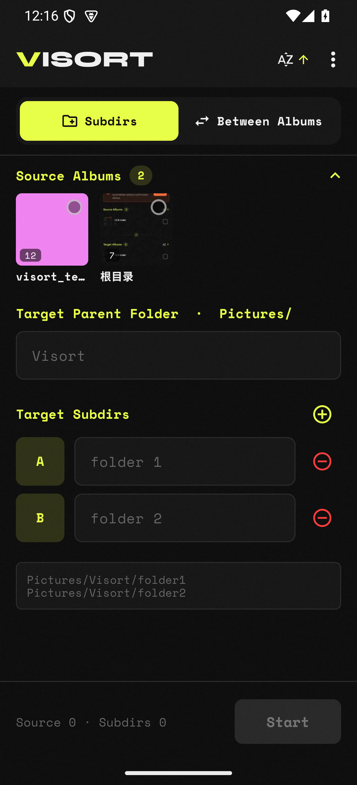
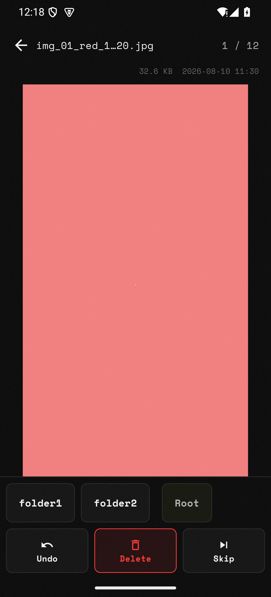
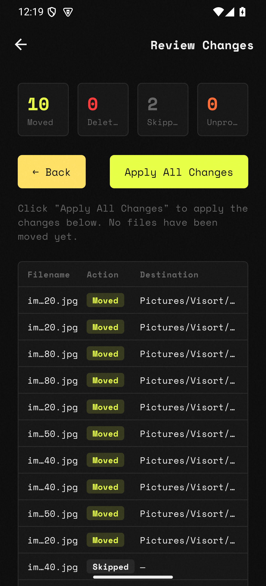
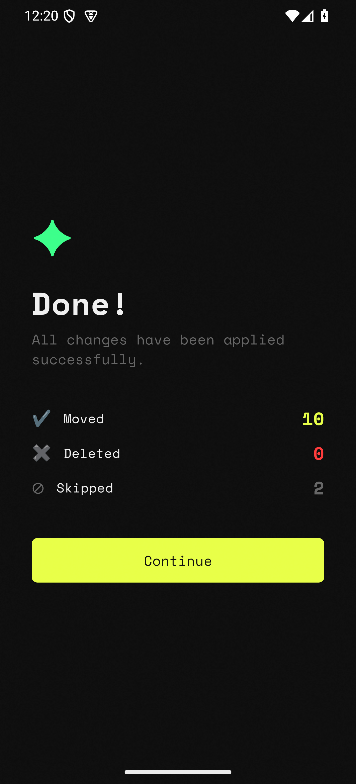

<div align="center">

# VISORT

**Keyboard-Driven Image Organizer** — Desktop + Android

Browse photos one by one, sort them with a single keypress. Nothing moves until you confirm.

[**中文文档**](README_zh.md)

[](https://flutter.dev)
[](https://dart.dev)
[](LICENSE)

</div>

---

## Why not just another gallery?

Mainstream galleries (Google Photos, OEM system galleries) are great at **browsing**, but weak at **organizing** — you either long-press to select photos one by one, then move them (slow enough that you give up), or hand it all to AI auto-classification (a black box you can't control). Photos pile up; you never get around to tidying.

VISORT is an **organizing tool**, not a viewer:

- **One-key pipeline** — Full-screen one photo, press one key (or tap a target) to classify it, the next comes up automatically. Blast through hundreds in minutes.
- **Staged + review, no accidents** — Every move / delete is staged in memory first; you get a full stats preview before anything is applied. Mainstream galleries delete instantly — VISORT lets you change your mind.
- **Fully local, zero cloud** — Photos never leave the device. No AI scanning, no uploads, no accounts.
- **Two sort modes** — Move into existing albums, or classify by custom sub-folder rules (key A → "keep", key B → "delete").
- **Cross-platform** — Windows desktop keyboard-driven + Android touch, same organizing logic.

> Core principle: **every operation is staged first, executed only on confirmation.** No accidental deletes, no accidental moves.

## Platforms

| Platform | Status | Highlights |
|---|---|---|
| **Android** | Active development · gallery experience is the focus | Native MediaStore album browsing + touch sorting |
| **Windows desktop** | Stable · feature-complete | Keyboard-driven sorting, window-state persistence |

The codebase is the **Flutter app** in [`visort_flutter/`](visort_flutter/), a verified port of a prior Python/Flask implementation (since removed).

---

## Android

Native MediaStore integration — operates directly on the system gallery, zero copies. Full organizing flow below (emulator screenshots):

### Album browsing & sort setup

<p align="center">
  
</p>

Keyset-paginated MediaStore gallery with live ContentObserver refresh. The home screen carries both the album list and the sort config: pick source albums (multi-select), set targets — move into existing albums (Between Albums), or classify by custom sub-folders (Subdirs, key A → "keep", key B → "delete").

### Sort

<p align="center">
  
</p>

Full-screen one photo, tap a bottom target to classify (folder1 / folder2 / root / delete / skip), the next comes up automatically — no long-press multi-select, hundreds in minutes.

### Review

<p align="center">
  
</p>

Full staged-operation stats (moved / deleted / skipped) with a per-file detail table before you commit. Everything is still in memory — nothing touched yet.

### Run

<p align="center">
  
</p>

Confirm to apply all changes at once. With media-management granted, batch move / delete is dialog-free; deletes go to the system trash, restorable.

---

**More:** favorites aggregated across albums · bilingual EN / ZH · auto numeric suffix on name collision

---

## Windows desktop

> Screenshots coming.

- **Keyboard first** — single-key move / delete / skip, full-screen one-by-one, far faster than mouse selection
- **Staged execution** — same as Android, all ops queue in memory, filesystem untouched until Run
- **Window memory** — position / size persisted, restored on next launch
- **Conflict handling** — auto-appends numeric suffix on name collision, never overwrites

---

## Quick start

Requires [Flutter ≥ 3.44](https://flutter.dev) (Dart ≥ 3.12).

```bash
git clone https://github.com/synxvi/visort.git
cd visort/visort_flutter
flutter pub get
flutter run -d android        # Android device/emulator
flutter run -d windows        # Windows desktop
```

Build:

```bash
flutter build apk --release       # → build/app/outputs/flutter-apk/
flutter build windows --release   # → build/windows/x64/runner/Release/
```

> Android release builds currently sign with debug keys (no production keystore yet).

## Supported formats

18 formats: JPG · PNG · GIF · BMP · WEBP · TIFF · TIF · SVG · ICO · HEIC · HEIF · RAW · CR2 · NEF · ARW · DNG · AVIF

## Tech stack

| Layer | Technology |
|---|---|
| UI / logic | Flutter (Dart ≥ 3.12), Riverpod ^2.6.1 |
| Android native | Kotlin + MediaStore (MethodChannel + EventChannel + ContentObserver) |
| Windows native | CMake runner (C++17) |
| Tests | `flutter_test`, 58 unit cases |
| State | Staged in memory, no DB |

## Documentation

- [`AGENTS.md`](AGENTS.md) — authoritative architecture & development guide
- [`docs/ANDROID_ROADMAP.md`](docs/ANDROID_ROADMAP.md) — Android port decisions (A0–A4, SAF→MediaStore, v2 album)
- [`visort_flutter/README.md`](visort_flutter/README.md) — Flutter app quick-start

## License

[MIT License](LICENSE)
